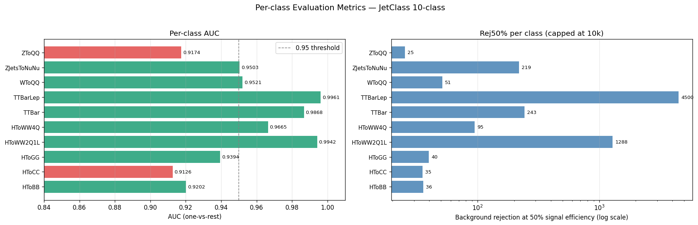

# Hybrid Lorentz-ParT MAE for JetClass Event Classification

## Overview
Jet classification at LHC scale needs models that are both **high-performing** and **stable across runs**.  
This project targets **10-class JetClass event classification** using a **hybrid ParT + Lorentz architecture** with **MAE pretraining** before supervised fine-tuning.  
The core research question is whether a physics-aware hybrid model, trained in a two-stage self-supervised pipeline, can improve both **final performance** and **training reliability**.  
All final claims and metrics are reported from: `notebook/6-Hybrid_LorentzParT_MAE_GSoC2026_FINAL -.ipynb`.

##  Key Contributions
- Designed a **hybrid ParT + Lorentz model** to combine particle-interaction modeling with Lorentz-aware representation learning.
- Demonstrated measurable **MAE pretraining impact** through controlled pretrain-vs-scratch comparisons.
- Reported **multi-seed behavior** (mean ± std) to evaluate reliability beyond single-run performance.
- Added **ablation-driven validation** to isolate where gains come from, rather than relying on aggregate results only.
- Integrated **stability-oriented engineering utilities** (checkpointing, early stopping, numerical safety, compile fallback) to make training robust.

## Why This Matters
-  **LHC relevance:** Better jet tagging directly supports downstream high-energy physics analyses.
-  **Reliable ML for physics:** Multi-seed reporting helps avoid over-trusting one lucky run.
-  **Evidence-driven modeling:** Ablations and controlled comparisons make conclusions more defensible.
-  **Research-to-engineering bridge:** The notebook sequence emphasizes reproducibility, not just headline metrics.

## Methodology
The final pipeline follows this sequence:
1. Load and prepare JetClass events (**100k sampled events**, **80/10/10 split**).
2. Build per-particle and pairwise physics-inspired features.
3. Pretrain with masked autoencoding on particle-level inputs.
4. Fine-tune on supervised jet labels.
5. Evaluate with macro AUC and accuracy, then validate gains through ablation and multi-seed analysis.

### Core Design Idea
- **Why MAE first?**  
  MAE pretraining initializes stronger particle-level representations before label supervision, improving downstream optimization stability.
- **Why a hybrid model?**  
  ParT and Lorentz-inspired branches capture complementary structure, improving representation coverage for jet classification.
- **Why gated fusion?**  
  Attention-gated fusion adaptively weights branch contributions per sample, instead of forcing a fixed branch mixture.

Core method blocks in the final notebook:
- **Hybrid architecture**: ParT branch + Lorentz-aware branch
- **Training flow**: MAE pretraining → fine-tuning
- **Fusion**: attention-gated branch fusion before classification

## Architecture Overview
The model processes particle-level features, learns complementary representations in ParT and Lorentz branches, and fuses them with learned gates for final class prediction.


## Training Strategy
The final notebook uses a **two-stage strategy**:
- **Stage 1 (Self-supervised):** MAE pretraining
- **Stage 2 (Supervised):** Fine-tuning for 10-class jet classification

Selection logic used in fine-tuning:
- Primary checkpoint metric: **validation macro AUC (OvR)**
- Fallback: if validation AUC is `NaN`, use **validation accuracy** for robust model selection

Primary tracked metrics:
- Accuracy
- Macro AUC (OvR)
- Macro AUC (OvO)

##  Results (Final Notebook)
From `notebook/6-Hybrid_LorentzParT_MAE_GSoC2026_FINAL -.ipynb`:

- **Overall Test Accuracy:** **0.7020**
- **Macro AUC (OvR):** **0.9536**
- **Macro AUC (OvO):** **0.9536**



## Ablation & Insights (Final Notebook)
Final ablation outputs report:
- `with_mae_pretrain`: `val_acc = 0.5961`, `val_auc = 0.919528`
- `no_mae_pretrain`: `val_acc = 0.5726`, `val_auc = 0.911468`

**Takeaway:** MAE pretraining gives a clear validation lift in both accuracy and macro AUC in controlled pretrain-vs-scratch comparison.


## Stability & Reliability
The final notebook includes a dedicated multi-seed comparison summary for pretrained vs scratch modes.

Reported MAE benefit summary:
- Accuracy gain: **+0.0282** (**+4.2% relative**)
- AUC gain: **+0.0070**
- Variance trend: **4.5× lower accuracy variance** with pretraining (reported summary)

Mean ± std bars are used in the comparison plot to communicate both performance level and variability across seeds.


##  Notebook Journey

### Notebook Progression Table
| Notebook | What was added | What problem it solved | Improvement it brought |
|---|---|---|---|
| `1-Hybrid_Lorentz_ParT_MAE_JetClass_GSoC2026.ipynb` | Initial end-to-end hybrid MAE workflow scaffold | Established a complete baseline pipeline | Enabled iterative experimentation on one consistent setup |
| `2-Hybrid_Lorentz_ParT_MAE_JetClass_GSoC2026 .ipynb` | Next pipeline refinement pass | Reduced workflow friction during repeated runs | Improved experimentation consistency |
| `3-Hybrid_Lorentz_ParT_MAE_JetClass_GSoC2026.ipynb` | Intermediate architecture/training refinements | Addressed early-stage modeling/training gaps | Prepared a stronger base for later consolidation |
| `4-Hybrid_Lorentz_ParT_MAE_JetClass_GSoC2026.ipynb` | Reliability-oriented updates before finalization | Improved confidence in comparative evaluation | Better stability analysis readiness |
| `5-Hybrid_Lorentz_ParT_MAE_JetClass_GSoC2026.ipynb` | Pre-final integration pass | Unified successful experimental elements | Reduced transition risk to final benchmark notebook |
| `6-Hybrid_LorentzParT_MAE_GSoC2026_FINAL -.ipynb` | Final consolidated benchmark pipeline | Single source of truth for final reporting | Best reported final performance and complete evidence package |

###  Iterative Improvements
- **Notebook 1 → 2**
  - **What changed:** Workflow refinement pass across setup/data/training organization.
  - **Why it changed:** Early experimentation needed lower friction for repeated runs.
  - **Improvement:** More consistent iteration loop and cleaner reruns.

- **Notebook 2 → 3**
  - **What changed:** Intermediate architecture and training refinements.
  - **Why it changed:** Baseline behavior exposed modeling/training gaps that limited robustness.
  - **Improvement:** Stronger foundation for later controlled comparisons.

- **Notebook 3 → 4**
  - **What changed:** Reliability-oriented updates plus multi-seed statistical framing.
  - **Why it changed:** Single-run reporting was not sufficient for research-grade conclusions.
  - **Improvement:** Better confidence in variability-aware evaluation.

- **Notebook 4 → 5**
  - **What changed:** Pre-final integration of validated components into a unified pipeline.
  - **Why it changed:** Consolidation was needed before final benchmark locking.
  - **Improvement:** Reduced transition risk and cleaner handoff to final benchmark notebook.

- **Notebook 5 → 6 (FINAL)**
  - **What changed:** Final consolidated benchmark with full reporting (metrics, ablation, multi-seed summary).
  - **Why it changed:** Produce one authoritative source for reproducible final claims.
  - **Improvement:** Complete evidence package with best reported final performance.


## Repository Structure
```text
gsoc-p-2-readme/
├── notebook/
│   ├── 1-Hybrid_Lorentz_ParT_MAE_JetClass_GSoC2026.ipynb
│   ├── 2-Hybrid_Lorentz_ParT_MAE_JetClass_GSoC2026 .ipynb
│   ├── 3-Hybrid_Lorentz_ParT_MAE_JetClass_GSoC2026.ipynb
│   ├── 4-Hybrid_Lorentz_ParT_MAE_JetClass_GSoC2026.ipynb
│   ├── 5-Hybrid_Lorentz_ParT_MAE_JetClass_GSoC2026.ipynb
│   └── 6-Hybrid_LorentzParT_MAE_GSoC2026_FINAL -.ipynb
├── images/
├── Research paper/
├── README_senior.md
└── README.md
```

##  Quick Start
```bash
# 1) Open the final benchmark notebook
notebook/6-Hybrid_LorentzParT_MAE_GSoC2026_FINAL -.ipynb
```

1. Ensure JetClass data is accessible at the path used in final notebook config (`../datasets/JetClass` by default).
2. Run notebook sections in order:
   - Setup and data loading
   - Feature engineering
   - MAE pretraining
   - Fine-tuning
   - Evaluation, ablation, and multi-seed analysis
3. Generated result plots are saved in the working directory (for example: `per_class_metrics.png`, `multiseed_comparison.png`).
4. Note: some notebook filenames intentionally include spaces/suffix characters; use exact names when opening files.

## Future Work
- Extend full multi-seed reporting with per-seed logs in final notebook outputs.
- Expand controlled ablations for fusion/gating choices under longer schedules.
- Explore stronger checkpoint averaging or ensembling on top of the current best run.
- Deepen joint classification + mass-regression analysis under the same training protocol.
- Add exportable experiment summaries for easier benchmark comparison across notebook versions.

## References
- Qu et al. (2022). *Particle Transformer for Jet Tagging.* [arXiv:2202.03772](https://arxiv.org/abs/2202.03772)
- Spinner et al. (2024). *Lorentz-Equivariant Geometric Algebra Transformers for High-Energy Physics.* [arXiv:2405.14806](https://arxiv.org/abs/2405.14806)
- He et al. (2022). *Masked Autoencoders Are Scalable Vision Learners.* [arXiv:2111.06377](https://arxiv.org/abs/2111.06377)
- Bardes et al. (2022). *VICReg: Variance-Invariance-Covariance Regularization.* [arXiv:2105.04906](https://arxiv.org/abs/2105.04906)
- Touvron et al. (2021). *Going deeper with Image Transformers (CaiT).* [arXiv:2103.17239](https://arxiv.org/abs/2103.17239)
- Nguyen (2025). *GSoC 2025 — Event Classification with Masked Transformer Autoencoders.* [Medium](https://medium.com/@thanhnguyen14401/gsoc-2025-with-ml4sci-event-classification-with-masked-transformer-autoencoders-6da369d42140)
- JetClass dataset (as used by the final notebook via ROOT files): [JetClass](https://zenodo.org/records/6619768)
